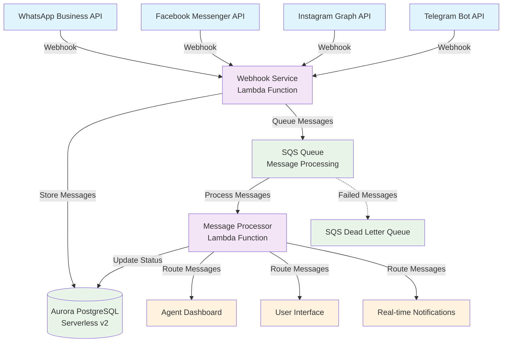
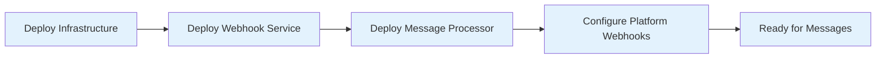
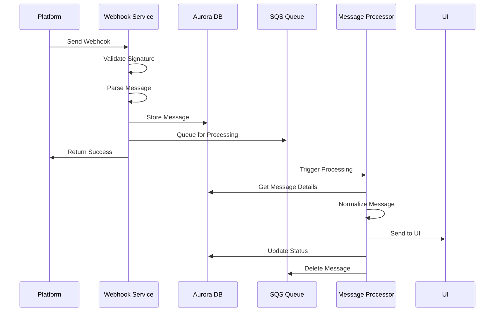

# Service Architecture Diagram (Mermaid)

```mermaid
graph TB
    %% External Platforms
    WA[WhatsApp Business API]
    FB[Facebook Messenger API]
    IG[Instagram Graph API]
    TG[Telegram Bot API]
    
    %% Webhook Service
    WS[Webhook Service<br/>Lambda Function]
    
    %% Infrastructure
    DB[(Aurora PostgreSQL<br/>Serverless v2)]
    SQ[SQS Queue<br/>Message Processing]
    DLQ[SQS Dead Letter Queue]
    
    %% Message Processor
    MP[Message Processor<br/>Lambda Function]
    
    %% Frontend
    AD[Agent Dashboard]
    UI[User Interface]
    RT[Real-time Notifications]
    
    %% Connections
    WA -->|Webhook| WS
    FB -->|Webhook| WS
    IG -->|Webhook| WS
    TG -->|Webhook| WS
    
    WS -->|Store Messages| DB
    WS -->|Queue Messages| SQ
    SQ -->|Process Messages| MP
    MP -->|Update Status| DB
    
    SQ -.->|Failed Messages| DLQ
    
    MP -->|Route Messages| AD
    MP -->|Route Messages| UI
    MP -->|Route Messages| RT
    
    %% Styling
    classDef platform fill:#e1f5fe
    classDef service fill:#f3e5f5
    classDef infrastructure fill:#e8f5e8
    classDef frontend fill:#fff3e0
    
    class WA,FB,IG,TG platform
    class WS,MP service
    class DB,SQ,DLQ infrastructure
    class AD,UI,RT frontend
```

## Deployment Flow

```mermaid
graph LR
    A[Deploy Infrastructure] --> B[Deploy Webhook Service]
    B --> C[Deploy Message Processor]
    C --> D[Configure Platform Webhooks]
    D --> E[Ready for Messages]
    
    classDef deploy fill:#e3f2fd
    class A,B,C,D,E deploy
```

## Message Processing Flow

```mermaid
sequenceDiagram
    participant P as Platform
    participant W as Webhook Service
    participant D as Aurora DB
    participant Q as SQS Queue
    participant M as Message Processor
    participant U as UI
    
    P->>W: Send Webhook
    W->>W: Validate Signature
    W->>W: Parse Message
    W->>D: Store Message
    W->>Q: Queue for Processing
    W->>P: Return Success
    
    Q->>M: Trigger Processing
    M->>D: Get Message Details
    M->>M: Normalize Message
    M->>U: Send to UI
    M->>D: Update Status
    M->>Q: Delete Message
```
